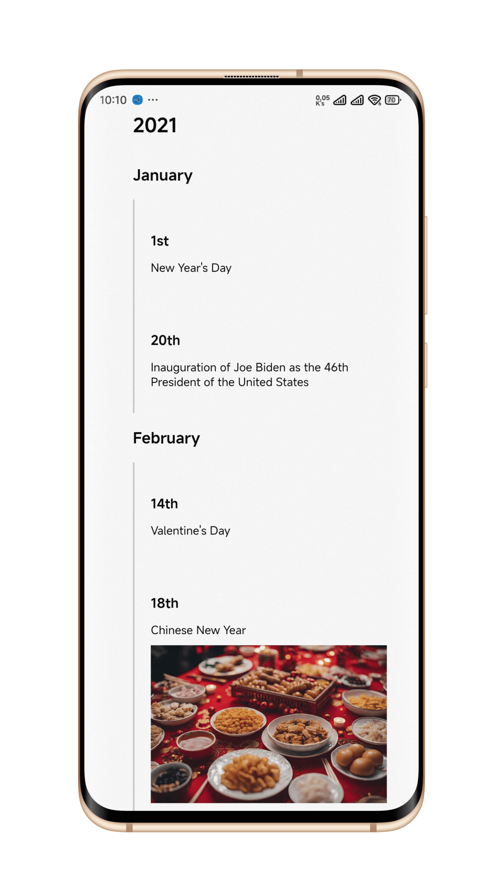

# Time Line for Your Life
> 个人事件记录时间轴

<p align = "left">

</p>

It's a simple static web page which supports PC and mobile devices.
> 这是一个十分简单的建静态网页，支持PC和移动端样式。

You need put your events into the `timelineData` variable in the `index.html` file.
> 你需要把你想要展示的事件放入`index.html`中的`timelineData`变量。

```javascript
const timelineData = [
    {
      year: '2021',
      months: [
        {
          month: 'January',
          events: [
            { date: '1st', content: 'New Year\'s Day', image: 'pics/20210218.jpg' },
            { date: '20th', content: 'Inauguration of Joe Biden as the 46th President of the United States' }
          ]
        }
      ]
    }
```

Using AI tool to help convert your own data into the `timelineData` variable.
> 可以借助任意的AI工具将你现有的数据转换成上述的格式。

After adding events, you can just upload this whole folder to your server and configure your web server to visit this folder.
> 在编辑完你自己的事件后，上传到你的服务器即可。

Or you can deploy it to [vercel](https://vercel.com) with default configuration.
> 你也可以在vercel上直接用默认配置部署。
